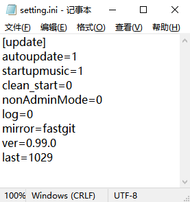

- github：https://github.com/Nigh/DoMiSo-genshin

> This document has been mostly translated by `deepl.com`

## Introduction(简介)

`DoMiSo` is a software that helps you play musical instruments fully automatically in the game 「Genshin Impact」.

`自动弹琴人偶` 是一个帮助你在游戏《原神》中全自动演奏乐器的软件。

## Download(下载)

- [Download Link-下载链接-1](https://download.fastgit.org/Nigh/DoMiSo-genshin/releases/latest/download/DomisoGenshin.zip)
- [Download Link-下载链接-2](https://github.com/Nigh/DoMiSo-genshin/releases/latest/download/DomisoGenshin.zip)
- [Download Link-下载链接-3](https://github.com.cnpmjs.org/Nigh/DoMiSo-genshin/releases/latest/download/DomisoGenshin.zip)

## Related Software(相关软件)
#### [LyreMaster-Genshin(手搓弹琴大师-原神)](https://github.com/Nigh/LyreMaster-Genshin)

`LyreMaster` is a software that helps you to play musical instruments easily in the game 「Genshin Impact」.

`手搓弹琴大师` 是一个帮助你在游戏《原神》中轻松演奏乐器的软件。


## Glossary of Terms(名词对照)
`numbered musical notation`:`简谱`

Special Edition Statute(特别版规约)
------------------
Any derivative works created using this version of the software (the Genshin Impact Special Edition) need to be credited in the work.
The source of the software should be properly acknowledged in the text description section.

Any infringement of third parties caused by the use of this software is the sole responsibility of the user.

任何使用本版本软件（原神特别版）创作的衍生作品均需要在作品中注明。
并在文字描述部分恰当的注明软件来源。

任何由于使用本软件对第三方所造成的侵害均由使用者本人负责。

## Communities(社群)
- Discord: https://discord.gg/5PCebykNaC
- 开黑啦: https://kaihei.co/IWXRLp

## Screenshot(截图)


Instructions(使用说明)
------------------

- Paste a valid sheet into the input box or use the `File` button to select a `txt` or `dms` sheet
- Click on `listen` to listen to the sheet in midi
- When `Genshin Impact` has started and you are in the music playing UI, click `Play` to play the sheet automatically in the game.
- Press the `F8` shortcut key to stop the automatic playing in the game
- Press the `F9` shortcut to start playing automatically in the game
- When there is a dividing line consisting of a row of equal signs `=` such as `========`, the part above the dividing line is considered a commentary and will not be played
- When there is a comment section in the sheet, use the `Encrypt` button to publish an encrypted sheet. The encrypted sheet will only show the comment section.


- 在输入框中粘贴有效的简谱或使用`File`按钮选择`txt`或`dms`谱
- 点击`listen`可以使用midi试听谱面
- 在`原神`游戏已经启动，并且在演奏界面时，点击`Play`可以自动在游戏中演奏谱面
- 按下`F8`快捷键可以停止游戏中的自动演奏
- 按下`F9`快捷键可以开始游戏中的自动演奏
- 当谱面中存在由一排等于号`=`如`========`构成的分割线时，分割线以上部分视为注释部分，不会演奏
- 当谱面中存在注释部分时，使用`Encrypt`按钮可以发布加密谱。加密谱面只会显示注释部分，不会显示演奏谱面

> As the `Genshin Impact` game is launched with administrator privileges, this software requires administrator privileges to interact with the game proper  
> 由于`原神`游戏以管理员权限启动，所以本软件需要管理员权限才能与游戏本体交互。

## AHK version

`1.1.33.7 Unicode 32bit`

[Update Log(更新日志)](changes.md)
------------------

Introduction(简介)
------------------
DoMiSo is a lightweight numbered musical notation interpreter that can convert formatted numbered musical notation into midi music and play it back.  
There are several example sheets in the same directory as this document. You can copy them to DoMiSo and play them back.

DoMiSo 是一个轻量级的简谱解释器，它能够将格式化的简谱转换成midi音乐并播放出来。  
在本说明文档的同目录下将会有几个示例简谱。用户可以将它们拷贝到DoMiSo中播放出来。

Syntax(语法)
------------------
DoMiSo's numbered musical notation format includes `control commands` and `note markers`.  
The control commands include `key control`, `tempo control` and `rollback control`.

DoMiSo的简谱格式包含控制命令与音符标记。  
其中控制命令包括调性控制，速度控制和回滚控制。

### Control commands(控制命令) ###

#### !!!Attention(注意)!!!

Due to restrictions in the game itself, it is not possible to play chromatic tones, so in this special edition, unplayable tones will be automatically ignored when played.

由于游戏本身限制，无法演奏半音，所以在此特别版中，无法演奏的音将会在演奏时自动忽略。

##### key control(调性控制)

`1=F#`

When no scale number is added, the default is the 5th scale. I.e. the above command is equivalent to

当不加音阶序号时，默认是第5个音阶。即上面的命令等价于：

`1=F5#`

Default `1=C` when no tonality is specified

没有规定调性时，默认`1=C`

##### tempo control(速度控制)

`bpm=120`

Valid bpm ranges from `1` to `480`, values outside this range are considered invalid and will reset bpm to the initial value of `80`.

When no tempo is specified, the default is `bpm=80`.

有效的bpm范围为1~480，超出此范围的数值视为无效，将会把bpm重置为初始值80。

没有规定速度时，默认`bpm=80`

##### rollback control(回滚控制)

`rollback=12.5`

The function of the Rollback command is to move the writing position of a note forward by `N` full note lengths at the current tempo. `N` can be a decimal number.

回滚命令的作用是将音符的书写位置前移N个当前速度下的全音符长度。N可以为小数。

When there are multiple parts, this command can be used to write multiple parts separately. Its use will be described later.

当存在多个声部时，可利用此命令来将多个声部分开书写。其用法将在后面介绍。

All control commands are case-insensitive and can be placed on the same line as the note. The command will be executed before the note is parsed, regardless of its position on the line.

所有控制命令不分大小写，而且可以与音符放在同一行。且不论命令在行中的什么位置，都将先执行命令，再解析音符。

### note(音符) ###

##### Examples(示例) #####

`++3b//` `-1#-/-` `5..` `( 1 3 5 )`

Each note is separated by a space and notes that do not meet the format are simply ignored.

每个音符之间由空格隔开，不符合格式的音符将会被直接忽略。

##### Pitch(音高) #####

The notes are marked from `0 to 7`, with the same meaning as in numbered musical notation.

音符标记从`0~7`，意义与普通简谱一致。

The notes preceded by `+` and `-` indicate that the note is raised or lowered by N steps, N being the number of `+` or `-`.

音符前面的`+`和`-`，表示将音符升高或降低N个音阶。N即为+或-的数量。

The `#` and `b` after the note indicate that the note is raised or lowered by half tone.

音符后面的`#`和`b`，表示将音符升高或降低半个全音。

##### Time(时值) #####

The time-related markers are `/` `-` `. `

与时值有关的标记有`/` `-` `.`

`/` means that the time of the preceding mark is reduced by half. The meaning is the same as the underscore in numbered musical notation.

`/` 表示将前面标记的音长减少一半。意义与普通简谱中的下划线一致。

`-` indicates the time of a whole note. The meaning is the same as in numbered musical notation. Can be used in combination with `/`.

`-` 表示一个全音符的时值。意义与普通简谱中一致。且可以与 / 组合使用。

`.` extends the time of the preceding note by half.

`.` 表示将前面音符的时值延长一半。

For example, `5..` has a note time of `1+0.5+0.25` beats.

比如 `5..` 的音符时值即为 1+0.5+0.25 拍。

`++3b//` has a note time of `0.25` beats.

`++3b//` 的音符时值即为 0.25 拍。

`-1#-/-` has a note time of `1+0.5+1` beats.

`-1#-/-` 的音符时值即为 1+0.5+1 拍。

`( 1 3- 5 )` has a note time of `2` beats. This is a chord. The use of the chord is described below.

`( 1 3- 5 )` 的音符时值为 2 拍。这是一个和弦。和弦的用法将在下面详述。

##### Chord(和弦) #####
Notes enclosed in brackets will be treated as chords. In this case, the brackets need to be separated from the notes by a space. Otherwise they will be ignored as invalid notes.

用括号括起来的音符将被视作和弦。其中，括号与音符之间需要用空格隔开。否则会被当作无效音符而忽略。

Each note in the chord will be played at the same time and the length of the whole chord is determined by the longest note in the chord.

和弦中的每个音符将在同时被演奏，整个和弦的时值由和弦中最长的音符决定。

RollBack
------------------
This is a RollBack usage example to demonstrate the basic usage of the RollBack command.

这是一个RollBack用法示例，用以演示RollBack命令的基本用法。

This is written using the chord:
这是使用和弦的写法：

```
    ( 1 -1 ) ( 2 -2 ) ( 3 -3 ) ( 4 -4 ) ( 5 -5 ) ( 6 -6 ) ( 7 -7 )
```

This is written using rollback command：
这是使用rollback的写法：

```
    1 2 3 4 5 6 7
    rollback=7
    -1 -2 -3 -4 -5 -6 -7
```

Rollback command animation demonstration：
rollback命令动画演示：


The effect is the same for both ways of writing. More usage can be found in the sample sketches in the `example_sheets` directory.
这两种写法的效果是一样的。更多用法可以参见`example_sheets`目录下的示例简谱。

Donate(捐助)
------------------

- Ko-fi: https://ko-fi.com/xianii
- Paypal: https://paypal.me/xianii
- Wechat: 
- Alipay: 

## Advanced Function(进阶功能)

### Setting.ini



After successfully running the software for the first time, a configuration file `setting.ini` will be generated in the same directory.

在第一次成功运行软件后，会在同目录下生成`setting.ini`的配置文件。

Automatic updates are turned on by default, specify `autoupdate=0` to turn them off.

软件的自动更新是默认开启的，指定`autoupdate=0`可以关闭自动更新。

Specify `startupmusic=0` to disable the opening music when the software is opened.

软件打开时会播放开场音乐，指定`startupmusic=0`可以关闭开场音乐。

Specify `clean_start=1` to clear the preset content in the edit box when the software is opened.

指定`clean_start=1`可以在软件打开后清除编辑框中的预置内容。

Specify `nonAdminMode=1` to open the software in non-admin mode, where it **cannot** play music in the game, but you can drag `txt` or `dms` files directly into the edit box.

指定`nonAdminMode=1`可以以非管理员模式打开软件，此时，软件**无法**在游戏中演奏音乐，但是可以直接拖放`txt`或`dms`文件至编辑框中。

Specify `log=0`,`log=1`,`log=2` to enable different levels of logging. The higher the number, the more detailed the log.

指定`log=0`,`log=1`,`log=2`启用不同等级的日志。数字越大，日志越详细。

Specify `mirror=0` to change the update source to `github.com`, the default update source for the software is `fastgit.org`. Mainland China users can try specifying `mirror=cnpmjs` to change the update source when updates fail frequently.

指定`mirror=0`可以将升级源更改为`github.com`，软件默认更新源是`fastgit.org`。中国大陆用户在升级频繁失败时，可以尝试指定 `mirror=cnpmjs` 更换升级源。

### Note statistics(音符统计)

The status bar now shows statistics on the number of notes and the number of notes that can be played in the game.

状态栏现在可以显示音符数量与能在游戏中演奏的音符数量的统计信息。
