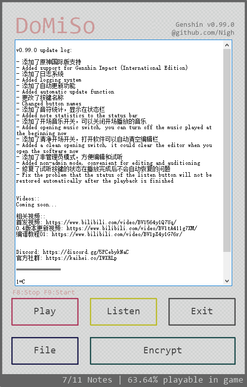

### [English Document](README_en.md)

### [中文文档](README.md)

- github托管：https://github.com/Nigh/DoMiSo
- gitee托管：https://gitee.com/xianii/domiso

特别版规约
------------------
任何使用本版本软件（原神特别版）创作的衍生作品均需要在作品中注明。
并在文字描述部分恰当的注明软件来源。

任何由于使用本软件对第三方所造成的侵害均由使用者本人负责。

## 社群
- 开黑啦: https://kaihei.co/IWXRLp

## 界面

使用说明
------------------
- 在输入框中粘贴有效的简谱或使用`File`按钮选择`txt`或`dms`谱
- 点击`Try`可以使用midi试听谱面
- 在`原神`游戏已经启动，并且在演奏界面时，点击`Play`可以自动在游戏中演奏谱面
- 按下`F8`快捷键可以停止游戏中的自动演奏
- 按下`F9`快捷键可以开始游戏中的自动演奏
- 当谱面中存在由一排等于号`=`如`========`构成的分割线时，分割线以上部分视为注释部分，不会演奏
- 当谱面中存在注释部分时，使用`Publish`按钮可以发布加密谱。加密谱面只会显示注释部分，不会显示演奏谱面

由于`原神`游戏以管理员权限启动，所以本软件需要管理员权限才能与游戏本体交互。

## AHK版本

`1.1.33.7 Unicode 32bit`

[更新日志](changes.md)
------------------

简介
------------------
DoMiSo 是一个轻量级的简谱解释器，它能够将格式化的简谱转换成midi音乐并播放出来。
在本说明文档的同目录下将会有几个示例简谱。用户可以将它们拷贝到DoMiSo中播放出来。

语法
------------------
DoMiSo的简谱格式包含控制命令与音符标记。
其中控制命令包括调性控制，速度控制和回滚控制。

### 控制命令 ###

#### !!!注意!!!
简谱解释器原神特别版由于游戏本身限制，音域受限。  
~~所以在此特别版中，调性命令将自动失效，固定调性为`1=C`~~

由于游戏本身限制，无法演奏半音，所以在此特别版中，无法演奏的音将会在~~试听和播放~~演奏时自动忽略。

##### 调性控制命令格式如下：

`1=F#`

当不加音阶序号时，默认是第5个音阶。即上面的命令等价于：

`1=F5#`

没有规定调性时，默认`1=C`

##### 速度控制命令格式如下：

`bpm=120`

有效的bpm范围为1~480，超出此范围的数值视为无效，将会把bpm重置为初始值80。

没有规定速度时，默认`bpm=80`

##### 回滚控制命令格式如下：

`rollback=12.5`

回滚命令的作用是将音符的书写位置前移N个当前速度下的全音符长度。N可以为小数。

当存在多个声部时，可利用此命令来将多个声部分开书写。其用法将在后面介绍。

所有控制命令不分大小写，而且可以与音符放在同一行。且不论命令在行中的什么位置，都将先执行命令，再解析音符。

### 音符标记 ###

##### 音符示例： #####

`++3b//` `-1#-/-` `5..` `( 1 3 5 )`

每个音符之间由空格隔开，不符合格式的音符将会被直接忽略。

##### 音高相关： #####

音符标记从`0~7`，意义与普通简谱一致。

音符前面的`+`和`-`，表示将音符升高或降低N个音阶。N即为+或-的数量。

音符后面的`#`和`b`，表示将音符升高或降低半个全音。

##### 长度相关： #####

与长度有关的标记有`/` `-` `.`

`/` 表示将前面标记的音长减少一半。意义与普通简谱中的下划线一致。

`-` 表示一个全音符的长度。意义与普通简谱中一致。且可以与 / 组合使用。

`.` 表示将前面音符的长度延长一半。

比如 `5..` 的音符长度即为 1+0.5+0.25 拍。

`++3b//` 的音符长度即为 0.25 拍。

`-1#-/-` 的音符长度即为 1+0.5+1 拍。

`( 1 3- 5 )` 的音符长度为 2 拍。这是一个和弦。和弦的用法将在下面详述。

##### 和弦： #####
用括号括起来的音符将被视作和弦。其中，括号与音符之间需要用空格隔开。否则会被当作无效音符而忽略。

和弦中的每个音符将在同时被演奏，整个和弦的长度由和弦中最长的音符决定。

RollBack示例
------------------
这是一个RollBack用法示例，用以演示RollBack命令的基本用法。

这是使用和弦的写法：

    ( 1 -1 ) ( 2 -2 ) ( 3 -3 ) ( 4 -4 ) ( 5 -5 ) ( 6 -6 ) ( 7 -7 )

这是使用rollback的写法：

    1 2 3 4 5 6 7 ;高音声部
    rollback=7 ;回滚7拍
    -1 -2 -3 -4 -5 -6 -7 ;低音声部

rollback命令动画演示：

这两种写法的效果是一样的。更多用法可以参见`example_sheets`目录下的示例简谱。

捐助
------------------

