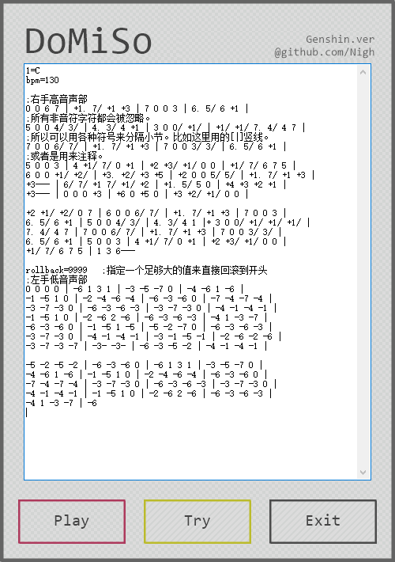
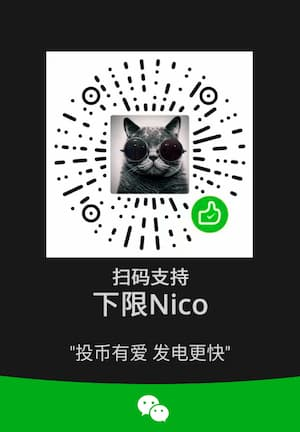

https://github.com/Nigh/DoMiSo-genshin

[简体中文](README_cn.md) - [English](README.md)

## 简介

`自动弹琴人偶` 是一个帮助你在游戏《原神》中全自动演奏乐器的软件。

## 视频
- Bilibili:
  - https://www.bilibili.com/video/BV1Sr4y1Q7AZ/
  - https://www.bilibili.com/video/BV1564y1Q7Uq/

## Download(下载)

- [GitHub下载](https://github.com/Nigh/DoMiSo-genshin/releases/latest/download/DomisoGenshin.zip)
- [镜像下载](https://mirror.ghproxy.com/https://github.com/Nigh/DoMiSo-genshin/releases/latest/download/DomisoGenshin.zip)

## 相关软件
#### [手搓弹琴大师-原神](https://github.com/Nigh/LyreMaster-Genshin)

`手搓弹琴大师` 是一个帮助你在游戏《原神》中轻松演奏乐器的软件。

特别版规约
------------------
任何使用本版本软件（原神特别版）创作的衍生作品均需要在作品中注明。
并在文字描述部分恰当的注明软件来源。

任何由于使用本软件对第三方所造成的侵害均由使用者本人负责。

## 社群
- Discord (全球): https://discord.gg/5PCebykNaC
- KOOK (中国大陆): https://kook.top/VXCE5O

## 截图

使用说明
------------------
- 在输入框中粘贴有效的简谱或使用`File`按钮选择`txt`或`dms`谱
- 点击`listen`可以使用midi试听谱面
- 在`原神`游戏已经启动，并且在演奏界面时，点击`Play`可以自动在游戏中演奏谱面
- 按下`F8`快捷键可以停止游戏中的自动演奏
- 按下`F9`快捷键可以开始游戏中的自动演奏
- 当谱面中存在由一排等于号`=`如`========`构成的分割线时，分割线以上部分视为注释部分，不会演奏
- 当谱面中存在注释部分时，使用`Encrypt`按钮可以发布加密谱。加密谱面只会显示注释部分，不会显示演奏谱面

> [!NOTE]  
> 由于`原神`游戏以管理员权限启动，所以本软件需要管理员权限才能与游戏本体交互。

## AHK 版本

`1.1.33.7 Unicode 32bit`

[更新日志](changes.md)
------------------

[语法](SYNTAX_cn.md)
------------------

捐助
------------------

- 爱发电: https://afdian.net/a/xianii

## 进阶功能

### 音符统计

状态栏现在可以显示音符数量与能在游戏中演奏的音符数量的统计信息。

## Stargazers over time

