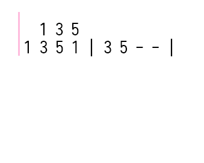

[简体中文](README_cn.md) - [English](README.md)

# 语法

DoMiSo的简谱格式包含控制命令与音符标记。  
其中控制命令包括调性控制，速度控制和回滚控制。

## 控制命令 ##

> [!WARNING]  
> 由于游戏本身限制，无法演奏半音，所以在此特别版中，无法演奏的音将会在演奏时自动忽略。

### 调性控制

`1=F#`

当不加音阶序号时，默认是第5个音阶。即上面的命令等价于：

`1=F5#`

没有规定调性时，默认`1=C`

### 速度控制

`bpm=120`

有效的bpm范围为1~480，超出此范围的数值视为无效，将会把bpm重置为初始值80。

没有规定速度时，默认`bpm=80`

### 回滚控制

`rollback=12.5`

回滚命令的作用是将音符的书写位置前移N个当前速度下的全音符长度。N可以为小数。

当存在多个声部时，可利用此命令来将多个声部分开书写。其用法将在后面介绍。

所有控制命令不分大小写，而且可以与音符放在同一行。且不论命令在行中的什么位置，都将先执行命令，再解析音符。

## 音符 ##

### 示例 ###

`++3b//` `-1#-/-` `5..` `( 1 3 5 )`

每个音符之间由空格隔开，不符合格式的音符将会被直接忽略。

### 音高 ###

音符标记从`0~7`，意义与普通简谱一致。

音符前面的`+`和`-`，表示将音符升高或降低N个音阶。N即为+或-的数量。

音符后面的`#`和`b`，表示将音符升高或降低半个全音。

### 时值 ###

与时值有关的标记有`/` `-` `.`

`/` 表示将前面标记的音长减少一半。意义与普通简谱中的下划线一致。

`-` 表示一个全音符的时值。意义与普通简谱中一致。且可以与 / 组合使用。

`.` 表示将前面音符的时值延长一半。

比如 `5..` 的音符时值即为 1+0.5+0.25 拍。

`++3b//` 的音符时值即为 0.25 拍。

`-1#-/-` 的音符时值即为 1+0.5+1 拍。

`( 1 3- 5 )` 的音符时值为 2 拍。这是一个和弦。和弦的用法将在下面详述。

### 和弦 ###

用括号括起来的音符将被视作和弦。其中，括号与音符之间需要用空格隔开。否则会被当作无效音符而忽略。

和弦中的每个音符将在同时被演奏，整个和弦的时值由和弦中最长的音符决定。

## 回滚(RollBack)

这是一个RollBack用法示例，用以演示RollBack命令的基本用法。

这是使用和弦的写法：

```
    ( 1 -1 ) ( 2 -2 ) ( 3 -3 ) ( 4 -4 ) ( 5 -5 ) ( 6 -6 ) ( 7 -7 )
```

这是使用rollback的写法：

```
    1 2 3 4 5 6 7
    rollback=7
    -1 -2 -3 -4 -5 -6 -7
```

rollback命令动画演示：



这两种写法的效果是一样的。更多用法可以参见`example_sheets`目录下的示例简谱。
